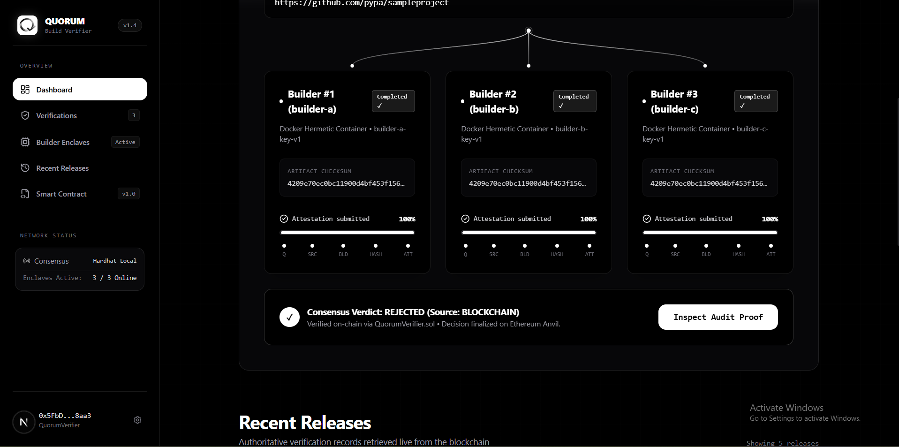
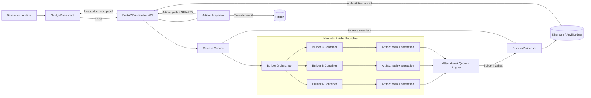

<div align="center">
  

  <h1>QUORUM</h1>

  <p><strong>Trust software releases. Not promises.</strong></p>
  <p>
    A decentralized reproducible-build verification system that independently
    rebuilds software, compares cryptographic fingerprints, and records the
    final verdict on-chain.
  </p>

  <p>
    
    
    
    
    
    
  </p>

  <p>
    <a href="#the-problem">Problem</a> •
    <a href="#how-quorum-works">How it works</a> •
    <a href="#architecture">Architecture</a> •
    <a href="#run-it-locally">Run locally</a> •
    <a href="#demo-scenarios">Demo</a> •
    <a href="#team">Team</a>
  </p>
</div>

---



## The problem

A public source repository does **not** prove that a published wheel, JAR, npm
package, binary, or container was built from that source.

A compromised CI server, stolen release credential, modified build machine, or
malicious dependency can publish an artifact whose bytes do not correspond to
the commit users inspected. Traditional checksums only prove that a downloaded
file has not changed after publication—they do not prove **where it came from**.

Quorum answers a stronger question:

> Can independent builders reproduce the published artifact from the exact
> source commit, and can anyone audit that decision afterward?

## The solution

Quorum turns software verification into an evidence pipeline:

1. A release is pinned to a public GitHub repository and an exact 40-character
   commit SHA.
2. Quorum detects a committed release artifact and calculates its SHA-256
   fingerprint.
3. Three named builders independently fetch and build the same commit inside
   short-lived, network-disabled Docker containers.
4. Each builder hashes the artifact it actually produced and signs a structured
   attestation.
5. A 2-of-3 quorum compares the independently observed hashes.
6. The `QuorumVerifier` smart contract stores the evidence and calculates the
   authoritative `VERIFIED`, `REJECTED`, or `DISPUTED` verdict.

The published artifact is **never sent to the builders**. Builders receive only
the source identity and an approved build profile, so they cannot copy or echo
the expected answer.

## Verdicts at a glance

| Verdict | Builder evidence | Meaning |
| --- | --- | --- |
| **VERIFIED** | At least 2 builders agree, and their quorum hash matches the published artifact hash | The published bytes were reproducibly built from the pinned source commit. |
| **REJECTED** | At least 2 builders agree, but their quorum hash differs from the published artifact hash | The published artifact was not produced from the pinned source under the approved build rules. |
| **DISPUTED** | All builders finish, but no hash reaches the required quorum | The build environments disagree; Quorum refuses to claim a trustworthy result. |

## How Quorum works

### What is a release?

A release is an immutable verification request containing:

```json
{
  "repository_url": "https://github.com/example/project",
  "commit_sha": "40-character-pinned-git-commit",
  "build_config_id": "python-package-v1",
  "artifact_name": "project-1.0.0-py3-none-any.whl",
  "published_hash": "64-character-sha256-digest",
  "builder_count": 3,
  "quorum_required": 2
}
```

The repository, commit, build profile, artifact name, published hash, and quorum
policy together define exactly what is being verified. Repeating an identical
finalized request is idempotent: Quorum returns the existing result immediately
instead of spending time and compute rebuilding it.

### What does each builder receive?

Only this five-field internal contract:

```json
{
  "release_id": "release-identifier",
  "repository_url": "https://github.com/example/project",
  "commit_sha": "40-character-pinned-git-commit",
  "build_config_id": "python-package-v1",
  "builders": ["builder-a", "builder-b", "builder-c"]
}
```

Build commands, Docker images, resource limits, and artifact-selection rules are
owned by the backend allowlist. A repository or frontend cannot supply arbitrary
shell commands.

### End-to-end verification flow

```text
Repository + pinned commit
          │
          ▼
Detect committed artifact ──► Stream SHA-256 ──► Create on-chain release
                                                       │
                              ┌────────────────────────┘
                              ▼
                   Multi-builder orchestrator
                    │          │          │
                    ▼          ▼          ▼
               Builder A   Builder B   Builder C
                    │          │          │
                    └──── signed attestations ────┐
                                                  ▼
                                      Validate identity and evidence
                                                  │
                                                  ▼
                                      Calculate local 2-of-3 quorum
                                                  │
                                                  ▼
                                      Submit hashes to smart contract
                                                  │
                                                  ▼
                                  VERIFIED / REJECTED / DISPUTED
```

## Architecture



### Component responsibilities

| Layer | Technology | Responsibility |
| --- | --- | --- |
| Dashboard | Next.js 16, React 19, Tailwind CSS, Framer Motion | Release input, automatic artifact detection, SHA generation, live builder states, audit logs, and recent on-chain releases. |
| API | FastAPI, Pydantic | Input validation, orchestration, idempotence, audit responses, and component integration. |
| Artifact inspector | Git + streaming `hashlib` | Fetches the exact commit, detects `.whl`, `.jar`, or `.tgz`, and hashes the selected committed artifact. |
| Builder manager | Python Docker SDK | Runs three isolated builds, captures bounded logs, selects outputs, hashes bytes, and creates attestations. |
| Trust layer | Ed25519 signatures | Binds each attestation to a known builder identity and protects evidence from modification. |
| Consensus | Local quorum engine + Solidity | Computes 2-of-3 agreement locally, then independently finalizes the authoritative verdict on-chain. |
| Ledger | Ethereum-compatible Anvil node | Stores release metadata, builder attestations, quorum hash, decision, and finalization state. |

## Supported build ecosystems

| Profile | Project marker | Produced artifact | Approved build strategy |
| --- | --- | --- | --- |
| `python-package-v1` | `pyproject.toml`, `setup.py`, or `setup.cfg` | `.whl` | Offline `python -m build --wheel --no-isolation` |
| `node-package-v1` | `package.json` | `.tgz` | `npm pack --ignore-scripts` |
| `java-maven-v1` | `pom.xml` | `.jar` | Offline Maven package using a warmed, pinned cache |
| `node-disputed-demo-v1` | `package.json` + explicit demo marker | `.tgz` | Safe demonstration profile that deliberately varies build bytes |

Artifact selection is deterministic. The inspector prefers the extension for the
detected profile and then known release locations such as `dist/`, `target/`,
`build/libs/`, and `build/`.

## Security by design

The builder treats repositories as untrusted input.

- **Pinned source:** every job fetches one exact commit and verifies `HEAD`.
- **HTTPS GitHub allowlist:** credentials, ports, redirects, queries, fragments,
  local paths, and internal-network repository targets are rejected.
- **No arbitrary commands:** callers select a predefined profile; commands are
  backend-controlled.
- **No build network:** containers run with `network_mode=none`.
- **Read-only filesystem:** source is mounted read-only and only `/out` plus a
  bounded temporary filesystem are writable.
- **Least privilege:** containers run as a non-root user with all capabilities
  dropped and `no-new-privileges` enabled.
- **Resource limits:** CPU, memory, PID count, output size, and execution time are
  bounded.
- **Ephemeral execution:** every build container is force-removed in a `finally`
  block after success, failure, or timeout.
- **Secret separation:** signing keys are never mounted inside build containers.
- **Cryptographic evidence:** artifacts use streaming SHA-256; attestations use
  canonical JSON and Ed25519 signatures.
- **No early trust:** a builder reports observations only. The quorum engine and
  smart contract decide the verdict.

> This repository is a hackathon prototype. The three builders currently model
> independent identities on one Docker host; a production deployment would
> distribute builders across separate operators, hosts, and hardened enclaves.

## What the blockchain stores

The smart contract stores compact verification evidence—not repositories or
artifact binaries.

For each release it records:

- repository identifier and pinned commit;
- published SHA-256 hash;
- expected builder count and quorum threshold;
- registered builder addresses and submitted artifact hashes;
- winning quorum hash, final decision, and finalization state;
- event timestamps and transaction history.

It does **not** store source code, wheel/JAR/npm package bytes, Docker logs,
private keys, or arbitrary user files.

## Repository map

```text
Quorum/
├── frontend/                 # Next.js dashboard and interaction layer
├── backend/                  # FastAPI routes, services, schemas, and tests
├── builders/
│   ├── manager/              # Validation, fetching, Docker, hashing, signing
│   ├── runner/               # Pinned Python, Node, and Maven images
│   ├── keys/                 # Local builder identities (private files ignored)
│   └── tests/                # Builder security and workflow tests
├── blockchain/
│   ├── contracts/            # QuorumVerifier Solidity contract
│   ├── scripts/              # Deploy, ABI export, and example flow
│   └── test/                 # Contract behavior tests
├── shared/specs/             # Cross-component request/evidence contracts
├── docs/                     # Engineering handoff and visual assets
├── infra/                    # Deployment and infrastructure scaffolding
└── requirements.txt          # Reproducible Python environment
```

## API surface

| Method | Endpoint | Purpose |
| --- | --- | --- |
| `GET` | `/health` | Backend and dependency health. |
| `POST` | `/api/v1/artifacts/detect` | Detect project type and committed artifact at a pinned commit. |
| `POST` | `/api/v1/artifacts/hash` | Stream SHA-256 over the selected committed artifact. |
| `POST` | `/api/v1/releases` | Create or reuse an on-chain release. |
| `GET` | `/api/v1/releases` | Read releases from blockchain state. |
| `POST` | `/api/v1/releases/{id}/verify` | Run builders, validate evidence, and finalize on-chain. |
| `GET` | `/api/v1/releases/{id}/result` | Retrieve the finalized audit proof. |
| `GET` | `/api/v1/releases/{id}/attestations` | Retrieve builder attestations for a release. |

Interactive API documentation is available at
[`http://127.0.0.1:8000/docs`](http://127.0.0.1:8000/docs) while the backend is running.

## Run it locally

### Prerequisites

- Git
- Docker Desktop
- Python 3.12+
- Node.js 22+
- npm

The commands below use Windows CMD and assume the repository is located at
`C:\SJ\Quorum-integration-review`.

### 1. Install dependencies

```cmd
cd /d C:\SJ\Quorum-integration-review

py -3.12 -m venv .venv
.venv\Scripts\python.exe -m pip install --upgrade pip
.venv\Scripts\python.exe -m pip install -r requirements.txt

cd blockchain
npm install

cd ..\frontend
npm install
```

### 2. Build the approved runner images

```cmd
cd /d C:\SJ\Quorum-integration-review

docker build -f builders/runner/Dockerfile -t quorum-python-package-v1:local builders/runner
docker build -f builders/runner/node.Dockerfile -t quorum-node-package-v1:local builders/runner
docker build -f builders/runner/java.Dockerfile -t quorum-java-maven-v1:local builders/runner
```

### 3. Start a clean local blockchain

```cmd
docker run -d --name quorum-anvil-e2e -p 127.0.0.1:8545:8545 ghcr.io/foundry-rs/foundry:latest "anvil --host 0.0.0.0 --port 8545 --chain-id 31337"
```

To deliberately erase all local ledger data and restart:

```cmd
docker rm -f quorum-anvil-e2e
docker run -d --name quorum-anvil-e2e -p 127.0.0.1:8545:8545 ghcr.io/foundry-rs/foundry:latest "anvil --host 0.0.0.0 --port 8545 --chain-id 31337"
```

### 4. Deploy the contract

```cmd
cd /d C:\SJ\Quorum-integration-review\blockchain
npm run compile
npm run deploy:anvil
npm run export-abi
```

### 5. Start the backend

```cmd
cd /d C:\SJ\Quorum-integration-review
copy .env.example .env
set PYTHONPATH=backend;.
.venv\Scripts\python.exe -m uvicorn app.main:app --host 127.0.0.1 --port 8000
```

### 6. Start the dashboard

Open another terminal:

```cmd
cd /d C:\SJ\Quorum-integration-review\frontend
npm run dev
```

Then open [`http://localhost:3000`](http://localhost:3000).

## Demo scenarios

Three public fixtures exercise every possible verdict:

| Scenario | Repository | Pinned commit | Expected result |
| --- | --- | --- | --- |
| Reproducible Python wheel | [`siddharthjha123/verified-python`](https://github.com/siddharthjha123/verified-python) | `5dc3ed4dcdcbf0d48f444239da0ed1ae2e10b2c5` | **VERIFIED** |
| Stale Java JAR | [`siddharthjha123/rejected-java`](https://github.com/siddharthjha123/rejected-java) | `fe205d2a9ed77116170ec0eb4b30f23ab7a3d6a7` | **REJECTED** |
| Intentionally divergent Node package | [`siddharthjha123/disputed-node`](https://github.com/siddharthjha123/disputed-node) | `063106f7a3d387c252fd71d5d06b55009bf4b4a1` | **DISPUTED** |

For each repository, paste its URL and full commit SHA into the dashboard, click
**Detect Artifact**, generate the **SHA Fingerprint**, and start verification.
Open **Inspect Audit Proof → View Logs** to see the real Git fetch, container,
build, artifact, hash, signing, and cleanup timeline for each builder.

## Quality checks

```cmd
cd /d C:\SJ\Quorum-integration-review

.venv\Scripts\python.exe -m pytest -q -p no:cacheprovider
.venv\Scripts\python.exe -m ruff check --no-cache backend builders

cd blockchain
npm run test

cd ..\frontend
npm run lint
npm run build
```

## Engineering documentation

- [Builder Engineer handoff](docs/builder-engineer-handoff.md)
- [Builder request contract](shared/specs/builder-request.md)
- [Builder attestation contract](shared/specs/builder-attestation.md)
- [Builder result contract](shared/specs/builder-results.md)
- [Artifact comparison rules](shared/specs/artifact-comparison.md)

## Team

<table>
  <tr>
    <td align="center"><strong>Siddharth Jha</strong><br/><sub>Builder & Integration Engineering</sub></td>
    <td align="center"><strong>Anand Kalambe</strong><br/><sub>Quorum & Backend Engineering</sub></td>
    <td align="center"><strong>Bala Sudalaimuthu</strong><br/><sub>Blockchain & Smart Contract Engineering</sub></td>
  </tr>
</table>

Built for the **Bit N Build '26 Internal Round** with one goal: make software
release trust independently verifiable.

---

<div align="center">
  
  <p><strong>QUORUM</strong></p>
  <p><sub>Source is a claim. Reproducibility is evidence. Consensus is trust.</sub></p>
</div>
